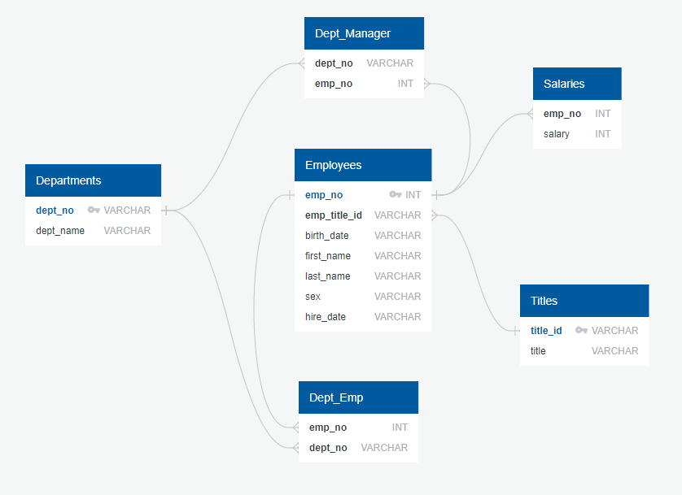

<h1 align = "center"> SQL Challenge </h1>

## Table of Contents

- [Criteria](#criteria)
- [Data](#data)
- [Results](#results)
- [Summary](#summary)
- [References](#references)
- [License](#license)

## Data

This project utilises six CSV files to analyse employee and department relationships within a company, focussing on salary distribution, titles, and managerial roles. The dataset, generated by edX Boot Camps LLC and intended for educational purposes, contains detailed information on employees, their associated departments, salaries, and positions. By examining various aspects of the employee database, this project applies data analysis techniques to uncover trends in organizational structure and compensation. These insights support better decision-making for human resources and organisational management.

<b> Departments Table: </b>

| Column | Description |
| ----------------------------- | ----------------------------- |
| dept_no | A unique identifier for each department. It serves as the primary key in the Departments table. |
| dept_name | The name of the department (e.g., Marketing, Finance). |

 

<b> Department_Employee Table: </b>

| Column | Description |
| ----------------------------- | ----------------------------- |
| emp_no | Employee number, linking the employee to their department (foreign key to Employees table). |
| dept_no | Department number, associating the employee with a department (foreign key to Departments table). |

 

<b> Department_Manager Table: </b>

| Column | Description |
| ----------------------------- | ----------------------------- |
| dept_no | Department number, representing the department that the manager oversees (foreign key to Departments table). |
| emp_no | Employee number, indicating which employee is the department manager (foreign key to Employees table). |

 

<b> Employees Table: </b>

| Column | Description |
| ----------------------------- | ----------------------------- |
| emp_no | A unique identifier for each employee. It serves as the primary key in the Employees table. |
| emp_title_id | The title ID of the employee (foreign key to Titles table). |
| birth_date | The employee's date of birth, useful for age-based analysis. |
| first_name | The employee's first name. |
| last_name | The employee's last name. |
| sex | Gender of the employee (e.g., M for Male, F for Female). |
| hire_date | The date when the employee was hired. |

 

<b> Salaries Table: </b>

| Column | Description |
| ----------------------------- | ----------------------------- |
| emp_no | Employee number, linking the salary record to a specific employee (foreign key to Employees table). |
| salary | The employee's salary, useful for salary analysis and compensation trends. |

 

<b> Titles Table: </b>

| Column | Description |
| ----------------------------- | ----------------------------- |
| title_id | A unique identifier for each title, serving as the primary key in the Titles table. |
| title | The job title (e.g., Engineer, Senior Staff). |

 

## Results

The Entity Relationship Diagram (ERD) for this dataset was created using Quick Database Diagrams.

## References

Data for this dataset was generated by edX Boot Camps LLC, and is intended for educational purposes only.

The ERD Diagram was created from here: https://app.quickdatabasediagrams.com/#/

## License

This project is licensed under the [MIT License](https://github.com/Yukitoshi12345/SQL-Challenge/blob/main/LICENSE).
